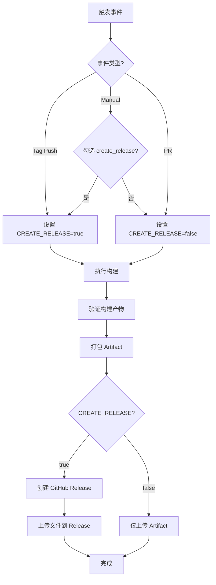

# GitHub Releases 自动发布指南

## 🎯 概述

工作流现在支持自动创建 GitHub Releases，将构建产物（.so 库文件和头文件）发布到仓库的 Releases 页面。

---

## 📦 发布触发条件

### 1. Tag 推送（自动发布）

当推送以 `v` 开头的 tag 时，自动创建 Release：

```bash
git tag v1.25.1
git push origin v1.25.1
```

**特点：**
- ✅ 自动触发
- ✅ 正式版本（非预发布）
- ✅ Tag 名称格式：`onnxruntime-alpine-v{version}`

### 2. 手动触发（可选）

在 GitHub Actions 页面手动运行工作流时，可以勾选 "Create GitHub Release" 选项。

**步骤：**
1. 进入 Actions → "Alpine Linux Build"
2. 点击 "Run workflow"
3. 勾选 "Create GitHub Release"
4. 点击 "Run workflow"

### 3. PR 构建（不发布）

Pull Request 触发的构建**不会**创建 Release，只上传 Artifact。

---

## 🏷️ Release 命名规范

### Tag 名称
```
onnxruntime-alpine-v1.25.1
```

### Release 标题
```
ONNX Runtime Alpine v1.25.1
```

### 预发布标记
- **Tag 推送** (`refs/tags/v*`)：正式版本 ✅
- **手动触发**：预发布版本 ⚠️

---

## 📝 Release 内容

### 包含的文件

```
Release Assets:
├── libonnxruntime.so.1.25.1              # 主库 (~24 MB)
├── libonnxruntime.so.1                   # 符号链接
├── libonnxruntime.so                     # 符号链接
├── libonnxruntime_providers_shared.so    # 提供者库 (~16 KB)
├── onnxruntime-headers-1.25.1.tar.gz     # 头文件包 (170 KB)
└── onnxruntime-headers-1.25.1.tar.gz.sha256  # 校验和
```

### Release 说明

自动生成详细的 Release 说明，包括：

1. **版本信息**
   - ONNX Runtime 版本
   - Alpine 版本
   - 架构（x86_64）
   - 构建日期

2. **文件清单**
   - 共享库文件列表
   - 头文件包信息

3. **优化特性**
   - 41 个 CMake 优化标志
   - musl libc 兼容性
   - LTO 禁用等

4. **使用示例**
   ```bash
   # 安装库文件
   sudo cp libonnxruntime.so* /usr/local/lib/
   sudo ldconfig
   
   # 安装头文件
   sudo tar -xzf onnxruntime-headers-*.tar.gz -C /usr/local/
   ```

5. **构建信息**
   - 触发方式
   - Commit SHA
   - Workflow 链接

---

## 🔧 配置参数

### 环境变量

```yaml
CREATE_RELEASE: ${{ 
  github.event.inputs.create_release == 'true' || 
  startsWith(github.ref, 'refs/tags/v') && 'true' || 
  'false' 
}}
```

**逻辑：**
- 如果是 tag 推送（`refs/tags/v*`）→ `true`
- 如果手动勾选 → `true`
- 其他情况 → `false`

**头文件配置：**
```yaml
INCLUDE_HEADERS: ${{ 
  github.event.inputs.include_headers == 'false' && 'false' || 'true' 
}}
```
- **默认值：`true`** - 始终包含头文件
- 只有显式设置为 `false` 时才不包含

### 输入参数

| 参数 | 类型 | 默认值 | 说明 |
|------|------|--------|------|
| `create_release` | boolean | `false` | 是否创建 Release |

---

## 📋 发布流程

### 完整流程图



### 详细步骤

1. **触发构建**
   - Tag 推送 / 手动触发 / PR

2. **编译 ONNX Runtime**
   - 在 Alpine 容器中执行
   - 应用所有优化

3. **验证输出**
   - 检查 .so 文件
   - 检查符号链接
   - 打包头文件

4. **准备 Artifact**
   - 复制到 `artifacts/` 目录
   - 生成 SHA256 校验和

5. **上传 Artifact**
   - 始终执行
   - 保留 30 天

6. **创建 Release**（条件执行）
   - 检查 `CREATE_RELEASE` 标志
   - 调用 `softprops/action-gh-release`
   - 上传所有文件
   - 生成 Release 说明

---

## 🎨 Release 示例

### Release 页面预览

```markdown
## ONNX Runtime for Alpine Linux

**Version:** 1.25.1  
**Alpine:** 3.23  
**Architecture:** x86_64  
**Build Date:** 2025-04-28T12:00:00Z

### 📦 Included Files

#### Shared Libraries
- `libonnxruntime.so.1.25.1` (~24 MB)
- `libonnxruntime_providers_shared.so` (~16 KB)
- Symbolic links: `libonnxruntime.so`, `libonnxruntime.so.1`

#### Development Headers (Optional)
- `onnxruntime-headers-1.25.1.tar.gz` (170 KB)
- 14 public API header files
- SHA256 checksum included

### ✨ Optimizations Applied

- ✅ 41 CMake optimization flags
- ✅ Complete GPU/accelerator disable (CUDA, ROCm, TensorRT, etc.)
- ✅ musl libc compatibility patch
- ✅ LTO disabled for Alpine stability
- ✅ Compiler warnings suppressed
- ✅ Only essential CPU inference dependencies

### 🔧 Usage

```bash
# Extract libraries
tar -xzf onnxruntime-alpine-v1.25.1.tar.gz

# Copy to system
sudo cp libonnxruntime.so* /usr/local/lib/
sudo cp libonnxruntime_providers_shared.so /usr/local/lib/
sudo ldconfig

# Optional: Install headers
sudo tar -xzf onnxruntime-headers-1.25.1.tar.gz -C /usr/local/
```

### 📝 Build Information

- **Triggered by:** push
- **Commit:** abc123def456...
- **Workflow:** Alpine Linux Build
- **Runner:** GitHub Actions (Alpine container)

### 🔗 Links

- [ONNX Runtime Official](https://github.com/microsoft/onnxruntime)
- [Build Workflow](https://github.com/user/repo/actions/runs/123456)
```

---

## 🚀 快速开始

### 方法 1：通过 Tag 发布（推荐）

```bash
# 1. 确保代码已提交
git add .
git commit -m "Update ONNX Runtime build"

# 2. 创建 tag
git tag v1.25.1

# 3. 推送 tag（触发自动发布）
git push origin v1.25.1
```

**结果：**
- ✅ 自动创建 Release
- ✅ 上传所有文件
- ✅ 生成详细说明

### 方法 2：手动发布

```bash
# 1. 进入 GitHub Actions
# 2. 选择 "Alpine Linux Build"
# 3. 点击 "Run workflow"
# 4. 设置参数：
#    - alpine_version: 3.23
#    - onnx_version: 1.25.1
#    - include_headers: true
#    - create_release: true ✓
# 5. 点击 "Run workflow"
```

**结果：**
- ✅ 创建预发布版本
- ✅ 上传所有文件

---

## ⚙️ 高级配置

### 修改 Release 行为

编辑 `.github/workflows/alpine_build.yml`：

```yaml
- name: Create GitHub Release
  uses: softprops/action-gh-release@v2
  with:
    draft: true              # 改为草稿，需要手动发布
    prerelease: true         # 强制设为预发布
    generate_release_notes: true  # 自动生成发行说明
```

### 自定义文件过滤

```yaml
files: |
  artifacts/*.so*
  artifacts/*.tar.gz
  artifacts/*.sha256
  # 添加更多文件模式
```

### 添加更多元数据

```yaml
with:
  body_path: RELEASE_NOTES.md  # 从文件读取说明
  discussion_category_name: Announcements  # 关联讨论
```

---

## 📊 发布统计

### 查看发布历史

```bash
# 列出所有 Release
gh release list

# 查看特定 Release
gh release view onnxruntime-alpine-v1.25.1

# 下载资产
gh release download onnxruntime-alpine-v1.25.1
```

### Release 信息

每个 Release 包含：
- 📦 6 个文件（库 + 头文件 + 校验和）
- 📝 详细的 Markdown 说明
- 🔗 构建工作流链接
- 📅 自动时间戳

---

## ⚠️ 注意事项

### 1. 权限要求

确保工作流有写入权限：

```yaml
permissions:
  contents: write  # 创建 Release 需要
```

### 2. Tag 命名

- ✅ 正确：`v1.25.1`, `v1.25.1-alpha`
- ❌ 错误：`1.25.1`, `release-1.25.1`

### 3. 重复发布

- 相同的 tag 不能重复创建 Release
- 如需重新发布，先删除旧 Release 和 tag

### 4. 文件大小限制

- GitHub Release 单个文件限制：2 GB
- 我们的文件远小于此限制（最大 ~24 MB）

### 5. 网络问题

- Release 上传可能需要几分钟
- 大文件上传时间更长

---

## 🔍 故障排除

### Q1: Release 没有创建？

**检查：**
1. 确认 `CREATE_RELEASE` 为 `true`
2. 确认不是 PR 构建
3. 检查 workflow 日志中的 "Create GitHub Release" 步骤

### Q2: 文件上传失败？

**检查：**
1. 确认 `artifacts/` 目录存在
2. 确认文件路径正确
3. 检查 GitHub token 权限

### Q3: Release 说明为空？

**检查：**
1. 确认 `body` 字段正确
2. 检查 YAML 缩进
3. 验证模板变量

### Q4: 想删除已发布的 Release？

```bash
# 删除 Release（保留 tag）
gh release delete onnxruntime-alpine-v1.25.1

# 删除 Release 和 tag
gh release delete onnxruntime-alpine-v1.25.1 --cleanup-tag
```

---

## 📈 最佳实践

### 1. 版本号管理

使用语义化版本：
```bash
git tag v1.25.1        # 正式版
git tag v1.25.1-rc1    # 候选版
git tag v1.25.1-beta   # 测试版
```

### 2. 发布前检查

- [ ] 构建成功
- [ ] 所有测试通过
- [ ] Artifact 完整
- [ ] 版本号正确

### 3. 发布后验证

- [ ] Release 页面显示正常
- [ ] 所有文件可下载
- [ ] 说明文档清晰
- [ ] 链接有效

### 4. 定期清理

- 删除过旧的预发布版本
- 归档不再支持的版本
- 保持 Release 列表整洁

---

## 🔗 相关资源

- **工作流文件**: [`alpine_build.yml`](./alpine_build.yml)
- **GitHub Releases API**: https://docs.github.com/en/rest/releases
- **softprops/action-gh-release**: https://github.com/softprops/action-gh-release
- **Artifact 说明**: [`BUILD_ARTIFACTS.md`](./BUILD_ARTIFACTS.md)

---

## ✅ 总结

现在工作流支持：

1. ✅ **自动发布** - Tag 推送时自动创建 Release
2. ✅ **手动发布** - 可勾选选项手动创建
3. ✅ **详细说明** - 自动生成完整的 Release 说明
4. ✅ **文件上传** - 所有构建产物自动上传
5. ✅ **版本管理** - 支持正式/预发布版本
6. ✅ **校验和** - 包含 SHA256 校验和文件

**推荐使用 Tag 推送方式进行发布！** 🚀
