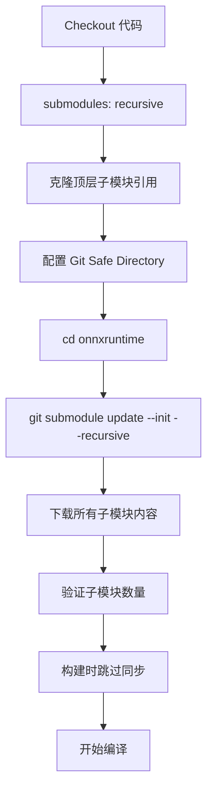

# Git 子模块初始化说明

## 🎯 问题背景

ONNX Runtime 仓库包含多个 Git 子模块，这些子模块必须在构建前正确初始化。

### 主要子模块

ONNX Runtime 依赖以下关键子模块：

```
onnxruntime/
├── cmake/external/
│   ├── abseil-cpp          # Google Abseil C++ 库
│   ├── protobuf            # Protocol Buffers
│   ├── re2                 # RE2 正则表达式库
│   ├── flatbuffers         # FlatBuffers 序列化库
│   ├── eigen               # Eigen 线性代数库
│   ├── onnx                # ONNX 格式定义
│   ├── date                # Date 时间库
│   ├── nlohmann-json       # JSON 库
│   ├── GSL                 # Guideline Support Library
│   └── ... (共 20+ 个子模块)
```

---

## 🔧 工作流中的处理

### 执行顺序（重要）

```yaml
1. Checkout 代码              # GitHub Actions 内置 action
2. 安装构建依赖               # apk add git cmake ...
3. 配置 Git Safe Directory    # git config ...
4. 初始化子模块               # git submodule update --init --recursive
5. 应用补丁                   # sed -i ...
6. 开始构建                   # bash ./build.sh ...
```

**为什么这个顺序？**
- ✅ Checkout 使用 GitHub Actions 内置工具，不依赖容器环境
- ✅ **先安装依赖**，确保 `git`、`cmake` 等工具可用
- ✅ 然后配置 Git 和初始化子模块
- ✅ 最后应用补丁和构建

### 1. Checkout 时递归克隆

```yaml
- name: Checkout repository
  uses: actions/checkout@v4
  with:
    submodules: recursive  # ✅ 递归克隆所有子模块
    fetch-depth: 1
```

**注意：** 这只会克隆顶层仓库的子模块引用，不会自动初始化嵌套的子模块。

### 2. 配置 Git Safe Directory

```yaml
- name: Configure git safe directory
  run: |
    git config --global --add safe.directory "$GITHUB_WORKSPACE"
    echo "✅ Git safe directory configured"
```

**原因：** GitHub Actions 容器中以 root 用户运行，需要配置安全目录。

### 3. 显式初始化子模块

```yaml
- name: Initialize and update submodules
  run: |
    echo "🔧 Initializing git submodules..."
    cd onnxruntime
    
    # Configure safe directory for submodule
    git config --global --add safe.directory "$GITHUB_WORKSPACE/onnxruntime"
    
    # Initialize and update submodules
    git submodule update --init --recursive
    
    echo "✅ Submodules initialized"
    echo "   Submodule count: $(git submodule | wc -l)"
```

**关键点：**
- ✅ 进入 `onnxruntime` 目录
- ✅ 配置该目录为安全目录
- ✅ 使用 `--recursive` 初始化嵌套子模块
- ✅ 显示子模块数量用于验证

### 4. 构建时跳过子模块同步

```yaml
bash ./build.sh \
  --skip_submodule_sync \  # ✅ 跳过，因为已手动初始化
  ...
```

**原因：** 子模块已在上一步初始化，无需在构建时再次同步。

---

## 📊 子模块初始化流程



---

## ⚠️ 常见问题

### Q1: 为什么需要显式初始化子模块？

**A:** 
- `actions/checkout` 的 `submodules: recursive` 只克隆第一层子模块
- ONNX Runtime 有嵌套子模块（子模块中还有子模块）
- 需要 `git submodule update --init --recursive` 完整初始化

### Q2: 不初始化子模块会怎样？

**A:** 构建会失败，出现以下错误：
```
CMake Error: The following variables are used in this project, but they are set to NOTFOUND.
Please set them or make sure they are set and tested correctly in the CMake files:
ABSEIL_CPP_INCLUDE_DIR
PROTOBUF_INCLUDE_DIR
...
```

### Q3: 子模块初始化需要多长时间？

**A:** 
- 首次初始化：~2-5 分钟（取决于网络）
- 缓存后：~30 秒
- GitHub Actions 有内置缓存，第二次构建会更快

### Q4: 如何验证子模块是否正确初始化？

**A:** 
```bash
# 检查子模块状态
git submodule status

# 应该看到类似输出：
# abc123 cmake/external/abseil-cpp (heads/master)
# def456 cmake/external/protobuf (heads/master)
# ...

# 检查子模块数量
git submodule | wc -l
# 应该显示 20+ 
```

### Q5: 子模块初始化失败怎么办？

**A:** 
1. 检查网络连接
2. 确认 Git 配置正确
3. 尝试重新初始化：
   ```bash
   git submodule deinit -f .
   git submodule update --init --recursive
   ```

---

## 🔍 调试技巧

### 查看子模块列表

```bash
cd onnxruntime
git submodule foreach --recursive 'echo $name'
```

### 查看子模块状态

```bash
git submodule status --recursive
```

### 手动更新特定子模块

```bash
git submodule update --init cmake/external/protobuf
```

### 清理并重新初始化

```bash
# 删除所有子模块
git submodule deinit -f .

# 重新初始化
git submodule update --init --recursive
```

---

## 📝 最佳实践

### 1. 始终使用 --recursive

```bash
# ✅ 正确
git submodule update --init --recursive

# ❌ 错误（可能遗漏嵌套子模块）
git submodule update --init
```

### 2. 配置 Safe Directory

在容器中运行时，必须配置：
```bash
git config --global --add safe.directory /path/to/repo
```

### 3. 跳过构建时的同步

如果已手动初始化，构建时使用：
```bash
bash ./build.sh --skip_submodule_sync ...
```

这样可以避免重复下载，加快构建速度。

### 4. 验证子模块完整性

构建前检查：
```bash
SUBMODULE_COUNT=$(git submodule | wc -l)
if [ "$SUBMODULE_COUNT" -lt 20 ]; then
  echo "❌ Submodules not fully initialized"
  exit 1
fi
```

---

## 🚀 本地开发

### 克隆仓库

```bash
# 方法 1：克隆时初始化子模块
git clone --recursive https://github.com/microsoft/onnxruntime.git

# 方法 2：克隆后初始化
git clone https://github.com/microsoft/onnxruntime.git
cd onnxruntime
git submodule update --init --recursive
```

### 更新子模块

```bash
# 更新所有子模块到最新版本
git submodule update --remote --recursive

# 或更新特定子模块
git submodule update --remote cmake/external/protobuf
```

### 添加新子模块

```bash
git submodule add <url> cmake/external/new-lib
git commit -m "Add new submodule"
```

---

## 📊 子模块统计

### ONNX Runtime v1.25.1

| 类别 | 数量 | 示例 |
|------|------|------|
| 核心依赖 | ~10 | abseil-cpp, protobuf, re2 |
| ML 相关 | ~5 | onnx, eigen, flatbuffers |
| 工具库 | ~8 | nlohmann-json, date, GSL |
| 测试框架 | ~3 | googletest, benchmark |
| **总计** | **~26** | - |

### 大小估算

- 空仓库：~50 MB
- 初始化子模块后：~500 MB - 1 GB
- 构建后：~2-3 GB

---

## 🔗 相关资源

- **Git 子模块文档**: https://git-scm.com/book/en/v2/Git-Tools-Submodules
- **ONNX Runtime 构建指南**: https://onnxruntime.ai/docs/build/
- **GitHub Actions Checkout**: https://github.com/actions/checkout

---

## ✅ 总结

**关键步骤：**
1. ✅ Checkout 时使用 `submodules: recursive`
2. ✅ 配置 Git Safe Directory
3. ✅ 显式运行 `git submodule update --init --recursive`
4. ✅ 构建时使用 `--skip_submodule_sync`

**验证方法：**
- 检查子模块数量（应 > 20）
- 检查关键目录是否存在
- 构建时不应报缺少依赖错误

**常见问题：**
- 网络超时 → 重试或使用镜像
- 权限问题 → 配置 safe.directory
- 嵌套子模块 → 使用 --recursive
